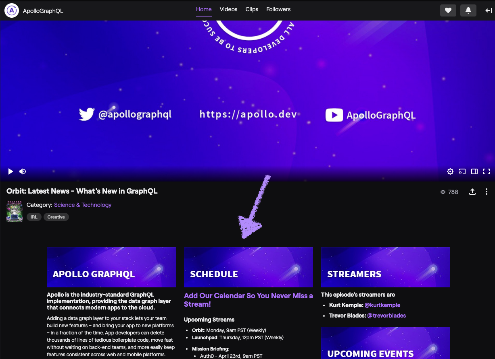

We're always looking for ways to engage with the Apollo community, and live streaming is an excellent way for us to do just that! If you're interested in how you can participate, or want to know when and what we stream, then read on!

## Where We Stream

Currently, we stream on [Twitch](https://twitch.tv/apollographql). However, we're looking at cross-streaming to other platforms like Twitter and YouTube!

> Want to see us stream on other platforms? Let us know [on social media](https://twitter.com/apollographql)!

## What We Stream

We think there's a lot of room for different types of content on a livestream, and so far we're focusing on the following shows:

- **Launch Pad**: This show is about building apps from start to finish! Each series will use a different technology stack to build functional apps that take advantage of the Apollo eco-system.

- **Mission Briefing**: This show is about tools, features, services, and general knowledge content coming from inside and outside Apollo.

- **Orbit**: This show is about what’s going on in the GraphQL/Apollo community such as events, tools, products, and content related to GraphQL.

> If you think we're missing something, we'd love to [hear your ideas](https://docs.google.com/forms/d/e/1FAIpQLScJ3BEzSxxackh-cbZgY5rPHh4jKzi4E46UJmkHbgKJvQY0mg/viewform)!

## Schedule

If you want to stay up to date on when we'll be streaming next, you can subscribe to [our calendar](https://go.apollo.dev/events-calendar) or check the [schedule panel on Twitch](https://twitch.tv/apollographql).

## Join Us

Have an idea you think would make for an amazing stream? Fill out [this form](https://docs.google.com/forms/d/e/1FAIpQLScJ3BEzSxxackh-cbZgY5rPHh4jKzi4E46UJmkHbgKJvQY0mg/viewform) and we'll get in touch!
